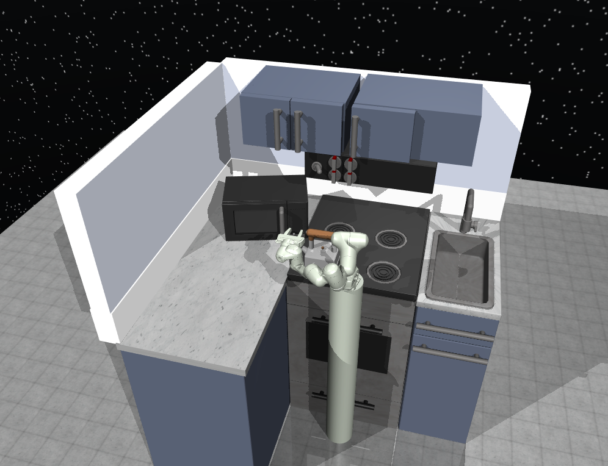

<h1 align="center">
Simulated Kitchen Robot Solving Long-horizon Manipulation Tasks with Short Action Library
</h1>

<h3>
<a href="https://dkguo.com">Dingkun Guo</a>,
<a href="https://github.com/Xiaofeng-Guo">Xiaofeng Guo</a>, and
<a href="https://yunchuzhang.github.io">Yunchu Zhang</a> 
 
(all authors contributed equally to this project)
</h3>

 

 

This work is the final project of Course 16-745: Optimal Control and Reinforcement Learning at Carnegie Mellon University, Pittsburgh, PA, USA in Spring 2022.

Abstract: We proposed a two stage optimization method for learning to solve long horizon manipulation tasks in a simulated kitchen environment in Mujoco. Our key innovation is to decompose the long horizon manipulation tasks into several short horizon manipulation actions and track those short actions’ trajectories with Time-varying Linear Quadratic Regulator (TVLQR). Then we chain the optimal actions with transitions to get a whole reference trajectory. By utilizing nonlinear trajectory optimization – iterative Linear Quadratic Regulator (iLQR), we obtained the optimal controller and smoother trajectories of long horizon manipulation tasks. Our key ideas in this work are: (1) building up a series of short horizon primitives based on expert demonstrations such as opening a microwave, turning on a switcher, and lifting and placing the kettle, and (2) chaining short actions’ trajectories with smooth transitions, then utilizing iLQR to smooth the whole trajectory to solve the long horizon manipulation tasks. In our experiments, we show that our method has smaller cost and robust performance compared to PID controller and open loop controller.
